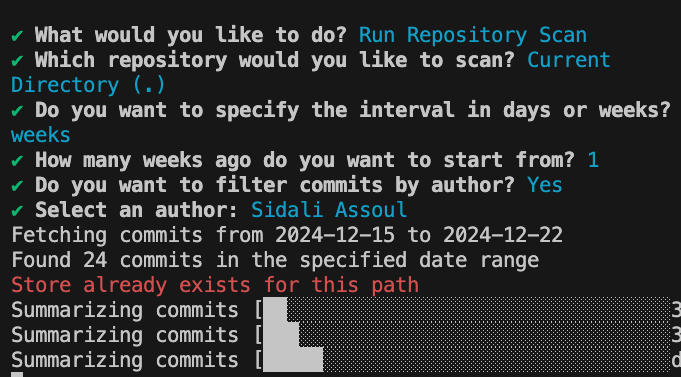
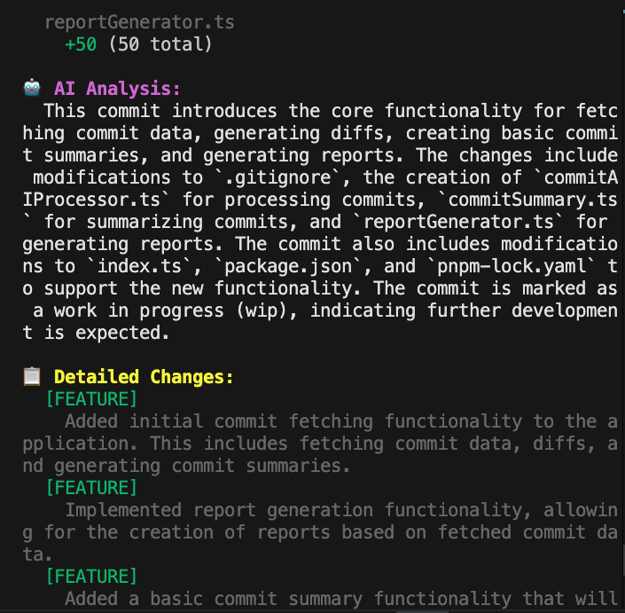
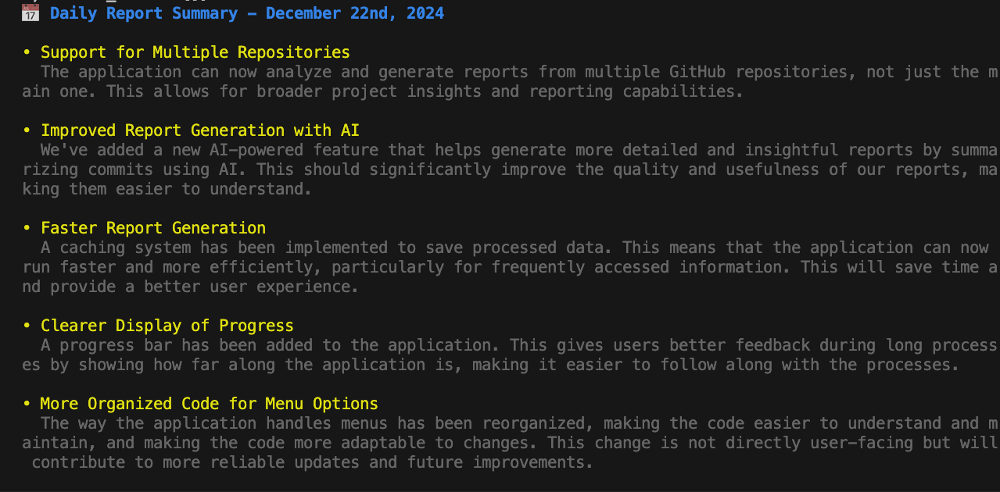

# AI Git Weekly Report Generator

Transform your Git commit history into meaningful insights with AI-powered analysis. This CLI tool processes your repository's commits to generate both technical summaries and business-friendly reports, making it easier to track and communicate development progress across your team.

## 🎯 Features

- 🤖 AI-powered commit analysis and categorization
- 📊 Dual reporting: Technical details and business-friendly summaries
- 📅 Flexible date range filtering
- 👥 Author-specific analysis support
- 💾 Smart caching for quick subsequent views
- 🔄 Support for both current and custom repository paths

## 🖥️ Interactive Menu

The tool provides an intuitive CLI interface with the following options:

### 1. Run Repository Scan

- Select repository (current directory or custom path)
- Choose date range and optional author filter
- AI processes commits and generates insights
- Caches results for quick future access

### 2. Display Technical Summary

- View detailed technical analysis of commits
- See code statistics and changes
- Access AI-generated technical insights
- Perfect for developers and technical leads

### 3. Display Report

- Business-friendly bullet-point summaries
- Focus on user-facing improvements
- Clear explanation of technical changes for non-technical stakeholders
- Ideal for project managers and stakeholders

## 🛠️ Prerequisites

- Node.js (Latest LTS version recommended)
- Git repository
- Google AI API key (for AI-powered analysis)

## 📦 Installation

1. Clone the repository:
```bash
git clone [your-repo-url]
cd ai-cli-github-weekly-report-generator
```

2. Install dependencies using pnpm:
```bash
npm install
```

3. Create a `.env` file in the root directory and add your Google AI API key:
```env
GOOGLE_API_KEY=your_api_key_here
```

## 🚀 Usage

Start the CLI tool:
```bash
npm start
```

The interactive CLI will guide you through:
- Selecting your repository
- Choosing date ranges for analysis
- Filtering by specific authors (optional)
- Viewing technical or business-friendly reports

## Tech Stack

- TypeScript
- LangChain with Google AI
- CLI Progress
- Inquirer for interactive CLI
- date-fns for date manipulation
- Zod for schema validation
- Chalk for CLI styling

## License

MIT

## Author

[Sid Ali Assoul](https://github.com/stormsidali2001)
